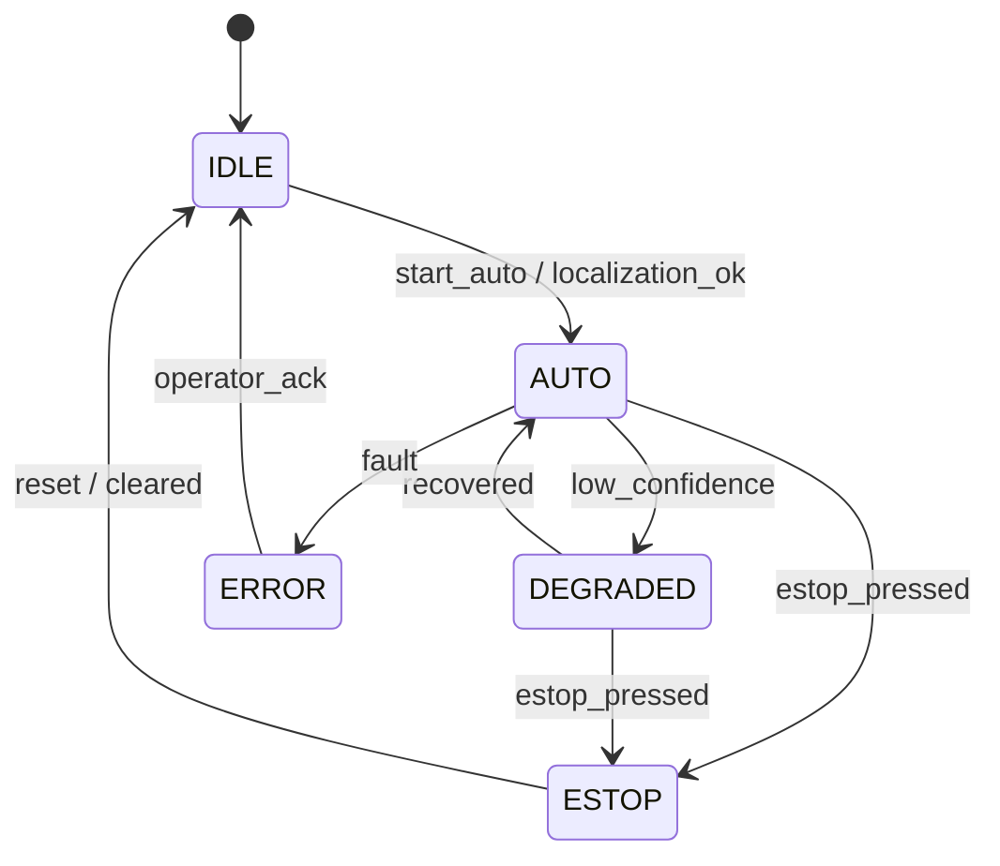
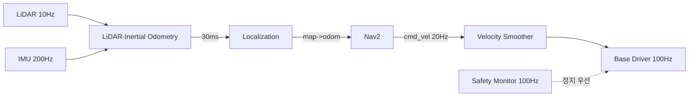

# 시스템 아키텍처 · 상태 기계

## 설계 순서

1. **경계를 먼저 긋는다** — 무엇이 안전 관련이고 무엇이 아닌가. 이 선이 모든 것을 결정한다.
2. **데이터 흐름을 그린다** — 센서 → 처리 → 결정 → 구동. 주기와 지연 예산을 각 화살표에 적는다.
3. **실패 모드를 나열한다** — 각 구성요소가 죽으면 무슨 일이 일어나는가.
4. 그 다음에 노드/프로세스로 나눈다.

**노드 분할을 먼저 하는 것이 가장 흔한 실수다.** 분할은 결과지 출발점이 아니다.

## 분할 기준

노드를 나누는 근거는 셋 중 하나여야 한다:

| 근거 | 예 |
|---|---|
| **실패 격리** — 죽어도 나머지가 살아야 함 | 안전 감시자, 센서 드라이버 |
| **주기 차이** — 1 kHz 와 10 Hz 를 한 노드에 두지 않는다 | 제어 루프 vs 경로 계획 |
| **자원 격리** — CPU/GPU 예산을 분리 | 인지 파이프라인 |

"기능이 다르니까" 는 근거가 아니다. 그건 클래스로 나누면 된다.
**노드를 나눌수록 직렬화·전송 비용과 디버깅 난이도가 오른다.**

## 계층 구조 (전형)

```
┌─ 임무/작업 계층      : 무엇을 할 것인가        (BT, 태스크 큐)      0.1~1 Hz
├─ 모드/상태 관리      : 지금 어떤 모드인가       (상태 기계)          이벤트
├─ 계획 계층           : 어떻게 갈 것인가        (전역/지역 플래너)    1~20 Hz
├─ 제어 계층           : 어떻게 움직일 것인가     (컨트롤러)          50~1000 Hz
├─ 하드웨어 추상화     : 어떻게 명령할 것인가     (HAL, ros2_control)
└─ 안전 계층 ◄─────── 모든 계층과 독립. 위가 다 죽어도 동작해야 한다
```

**안전 계층은 계층이 아니라 옆에 있는 것**으로 그린다. 상위 계층을 거쳐서 정지시키는 구조는
상위가 죽으면 정지도 못 한다.

## 상태 기계 설계

### 언제 상태 기계인가
- **모드 관리**: 대기 / 수동 / 자율 / 충전 / 오류 / 정비 — 상태가 적고 전이 규칙이 명확
- **하드웨어 수명주기**: 미초기화 → 초기화 → 준비 → 동작 → 정지
- 작업 시퀀스가 복잡하고 회복 분기가 많으면 → Behavior Tree (`behavior-tree` 스킬)

실무 정답은 **계층 분리**: 상위 모드는 상태 기계, 모드 안의 작업은 BT.

### 설계 규칙
- **모든 상태에서 오류 상태로 가는 전이가 있어야 한다.** 없으면 이상 상황에서 로봇이 굳는다.
- 전이 조건을 표로 만든다. 코드보다 표가 먼저다.

| 현재 | 이벤트 | 다음 | 진입 동작 |
|---|---|---|---|
| IDLE | 자율 시작 요청 + 로컬라이제이션 OK | AUTO | 플래너 활성화 |
| AUTO | E-stop | ESTOP | 즉시 정지, 모든 모션 취소 |
| AUTO | 로컬라이제이션 신뢰도 저하 | DEGRADED | 감속, 정지 후 재측위 |
| \* | 심각 오류 | ERROR | 안전 정지, 원인 기록 |

- **진입 동작(entry action)과 퇴장 동작을 명시**한다. 상태에 들어갈 때 무엇을 켜고
  나갈 때 무엇을 끄는지가 정의되지 않으면 리소스가 새거나 모터가 계속 돈다.
- 상태를 토픽으로 **발행**한다. 현장에서 "지금 무슨 상태냐" 를 물어볼 수 있어야 한다.
- 전이 로그를 남긴다. 사고 분석은 전이 이력으로 한다.
- ROS 2 라면 lifecycle node 를 활용한다 (`ros2-engineering/references/lifecycle-components.md`).

## 다이어그램

**Mermaid 를 기본으로 쓴다** — 마크다운·PR·아티팩트에서 바로 렌더링된다.

상태도:
````

````

데이터 흐름(주기·지연을 반드시 적는다):
````

````

- 다이어그램에 **주기와 지연 예산**을 적지 않으면 그림일 뿐이다.
- 안전 경로는 점선 등으로 시각적으로 구분한다.

## 인터페이스 정의

- 서브시스템 경계의 인터페이스를 **먼저 확정**하고 문서화한다.
  메시지 타입, 프레임, 단위, 주기, QoS, 실패 시 동작.
- 인터페이스가 바뀌면 ADR 로 기록한다. 왜 바뀌었는지가 6개월 뒤에 필요해진다.
- 커스텀 메시지는 최소화한다. 표준 타입(`sensor_msgs`, `nav_msgs`, `geometry_msgs`)을 쓰면
  기성 도구(RViz, Nav2)가 그냥 붙는다.

## 기존 코드베이스를 파악할 때 (코드 개요)

순서:
1. **launch 파일부터** 읽는다 — 실제로 무엇이 뜨는지가 여기 있다. README 보다 정확하다.
2. `ros2 node list` / `ros2 topic list` 로 **실행 중인 실제 그래프**를 본다.
   코드에는 있지만 안 뜨는 노드가 항상 있다.
3. `rqt_graph` 로 연결을 시각화한다.
4. 패키지의 `package.xml` 의존성으로 계층을 추정한다.
5. 그 다음에 소스를 읽는다.

산출물로 **노드 목록 + 토픽 흐름도 + 주기표**를 만들어 두면 이후 모든 논의가 빨라진다.

## 문서화 원칙

- 아키텍처 문서는 **결정과 이유**를 적는다. 구조만 그리면 6개월 뒤에 왜 그런지 아무도 모른다.
- ADR 형식(맥락 / 결정 / 결과·트레이드오프)을 쓴다. `/architecture:adr` 커맨드가 있다.
- 코드와 문서가 다르면 **코드가 진실**이다. 문서를 코드에서 생성할 수 있으면 그렇게 한다.
- 그림은 소스(Mermaid 텍스트)로 버전 관리한다. PNG 만 있으면 아무도 못 고친다.
